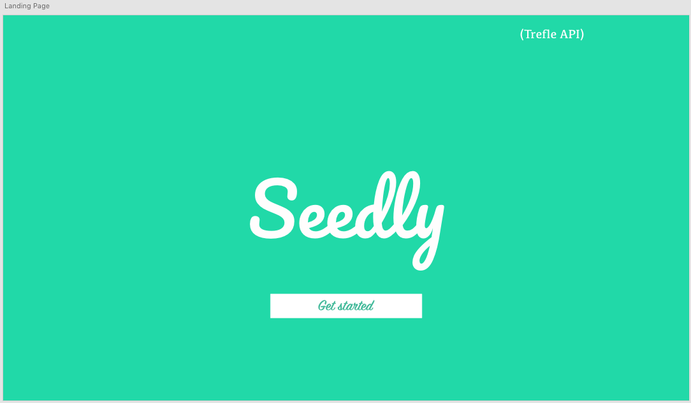
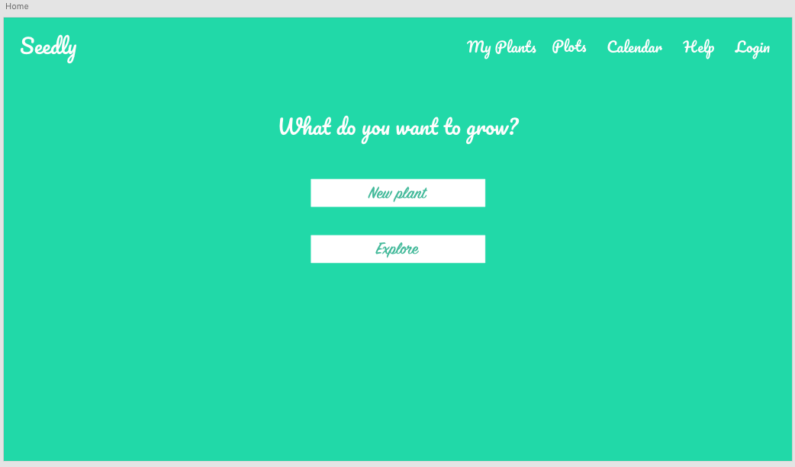
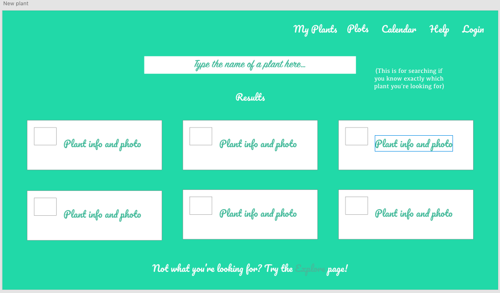
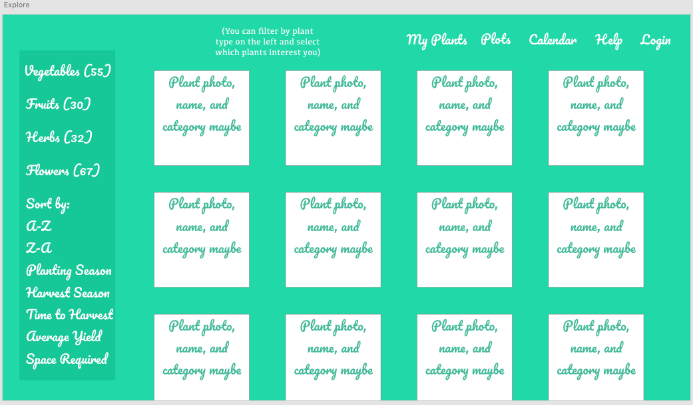

# Mod2-Project-Proposal

# Seedly

## Description
Seedly is an aspiring gardener's best friend. If you've ever wanted to start gardening, whether you have a huge backyard or just the space on your windowsill, Seedly is for you. This app uses the Trefle API to allow users to search for produce, herbs, and flowers they'd like to plant and create "plot plans" to set up their garden in the most efficient way possible.

## API Info
Documentation Start
https://docs.trefle.io/docs/guides/getting-started

Searching for Specifics
https://docs.trefle.io/docs/guides/searching

Plants Fields
https://docs.trefle.io/docs/advanced/plants-fields

## Expected roadblocks
I can see the login/registration for the site being a little difficult, I don't know Firebase (yet) so that's definitely a must. Also setting up the search function may be tough, worst case scenario I would just consolidate adding a new plant into the Explore function so that the search bar wouldn't even be an issue. Also time, but that is always the case.

## Timeframe/Schedule
Tuesday: Set up client-side API key thing, make sure that works, and start working on filtering results by which ones have grow information and common names available.

Wednesday: Start setting up Components, from Landing Page out. Make sure results are populating on Explore page if I'm done setting it up. Start learning Firebase if possible/another way to keep track of user login/registration.

Thursday: Continue component setup if not already done. Maybe start adding Router at this point. Focus on My Plots and My Plants components. 

Friday: Continue component setup and start testing and styling.

Saturday: Finish components and continue styling and testing.

Sunday: Same as Saturday, most likely.

## Wireframe
Landing Page

Home 

New Plant

Explore

